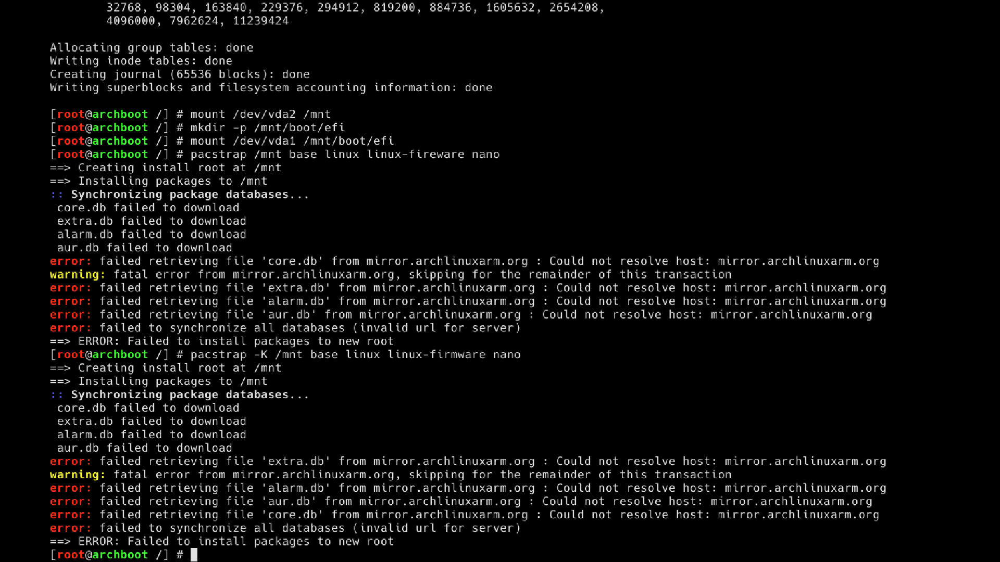
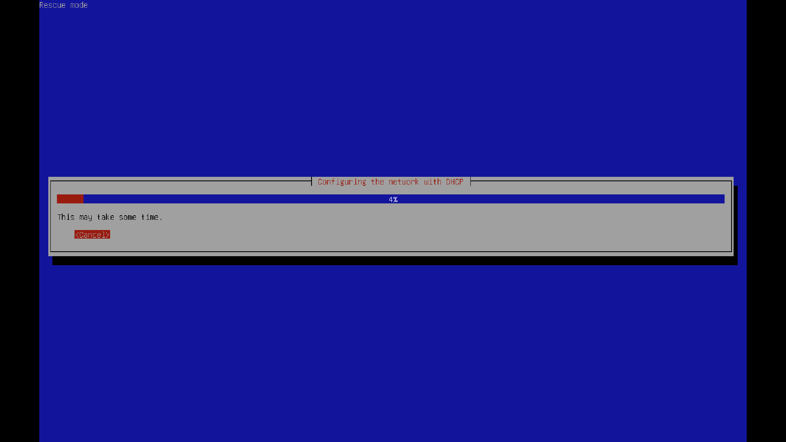
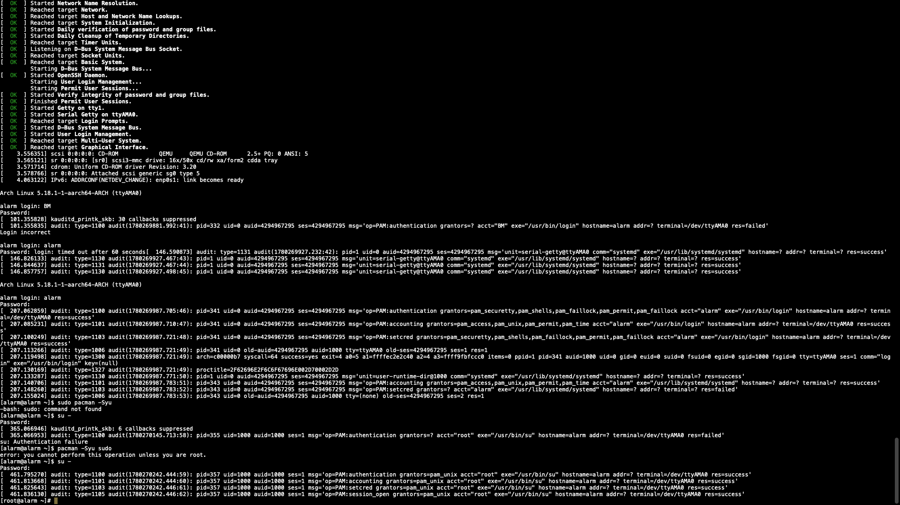

# ❌ Failed Installation Attempts

> This document records every failed attempt before finding the working solution.

---

## ❌ Attempt 1 — UTM + Arch Linux ISO

**What we tried:** Creating a VM in UTM with the official Arch aarch64 ISO.

**What happened:** The ISO booted but `sudo`, `fdisk`, and `pacman` were missing.

**Root cause:** The Arch Linux ARM image is not an installer — it's a minimal tarball, not a bootable installer with tools.

---

## ❌ Attempt 2 — UTM + Archboot

**What we tried:** Archboot, a more complete Arch installer for ARM64.

**What happened:** Booted but no network. Manual fixes failed:
```bash
ip link set dev enp0s1 up
dhcpcd enp0s1
```


**Root cause:** UTM on M2 has known bugs with VirtIO network initialization in the installer environment.

---

## ❌ Attempt 3 — UTM + Debian → Arch

**What we tried:** Install Debian first, then bootstrap Arch from it.

**What happened:** Same DHCP failure as Attempt 2.
 

**Root cause:** The issue was UTM's network layer, not the distro.

---

## ❌ Attempt 4 — UTM Gallery images

**What we tried:** Pre-built images from UTM's gallery.

**What happened:** Same network issues or too locked-down for BlackArch repo.


---

## ✅ Solution — OrbStack

Switched to OrbStack. Network works automatically, Arch available natively.

See [orbstack-setup.md](./orbstack-setup.md)
